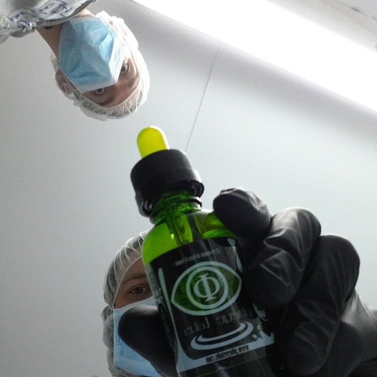
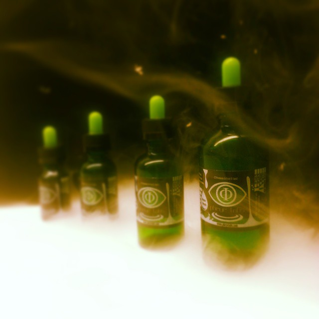
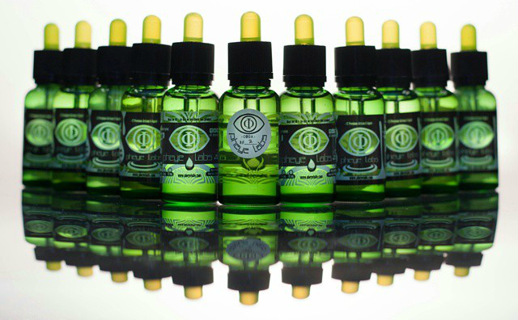

-

-

-

###### Branding, product, and marketing solutions for Pheye Labs.

###### Pheye Labs is a manufacturer of E-juice in Connecticut.

> __Electronic cigarettes were like the wild west.__

When the electronic cigarette market first took off, it was complete wild west. It was completely new industry with no precedent on how to approach the marketing.

This was a really fun endeavor as I got to handle the branding, marketing, and product design almost completely independently. This was also a huge learning experience because before this, I had only ever done design for digital media.

> __The bottle__

So Pheye Labs was going for a heady, futuristic look but it also needed to look clean. The product was something that people were going to be putting in their body and needed to appeal to the customer in a way that made them feel confident in it's quality. It was made in lab conditions and we had to come up with a look that played well with that. It also could be dangerous if children got their hands on it so we needed to make sure it didn't look like something a kid would like.

###### So we went for a "Space Medicine" look.

  

  

  
 
  

  

  

  
 
  

 
 
