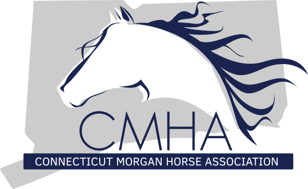
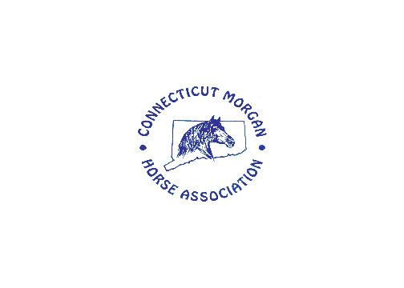
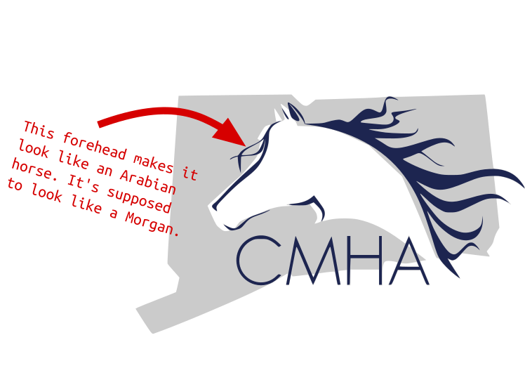
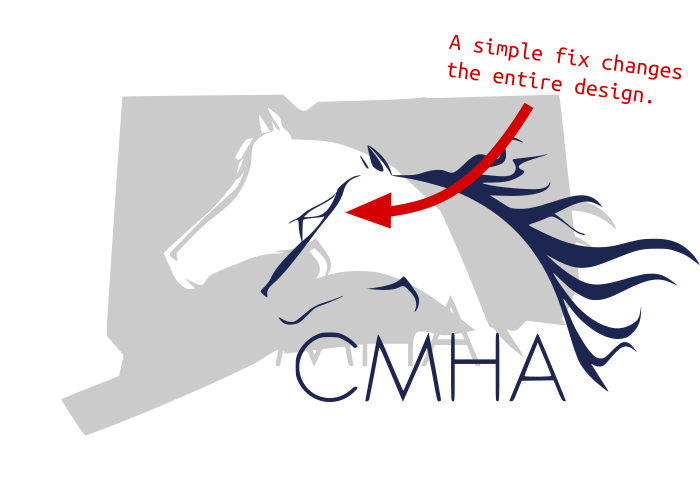
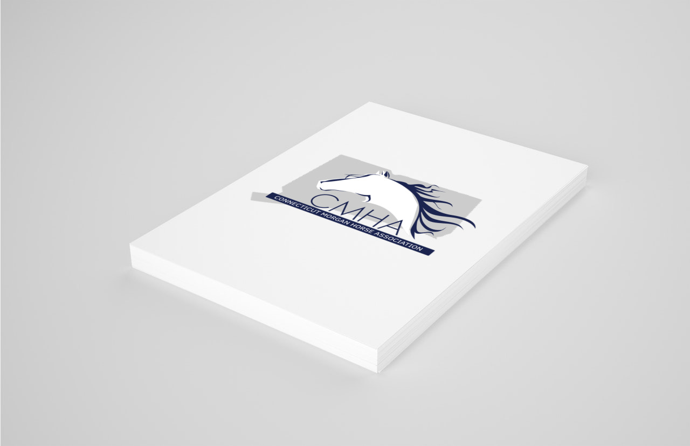
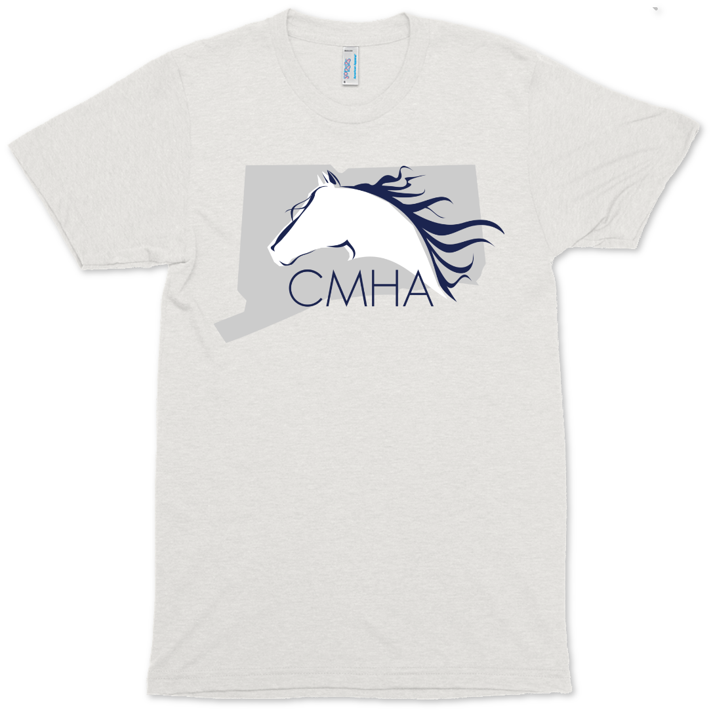
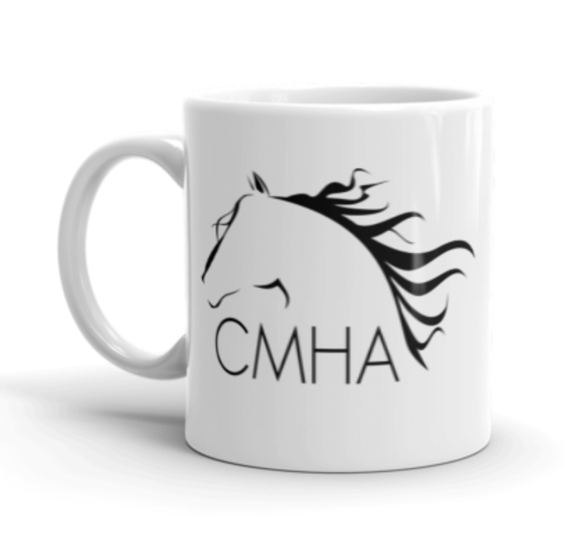

-

-

-

##### Logo re-design for the CT Morgan Horse Association.

##### Old logo. Classic but needed an update.
  

I was tasked with re-designing a logo for the CT Morgan Horse Association. Let me tell you something about me.
  

**I don't like horses.**

  
I don't have anything against them personally. I've never been bamboozled by a horse. I just don't trust them. They are too big and muscular. I like them in theory but I've been ruined by watching videos online of cowboys get kicked in the head.
  
This led to some interesting discoveries on my part. Apparently there are different kinds of horses.
  
Initially I though "I'll just make an elegant, simple horse head. Something with a painterly feel that kind of vibes with the New England horse community." So I created a logo after looking up pictures of horses on Google.

</img>
##### First draft. It looks like a horse... just not the right kind of horse.
  

<h2>Did you know different breeds of horses have different shaped heads?</h2>

They do. I didn't know that going in. That's ok, it's an easy fix.
  
</img>
##### Boom. Morgan horse.
  

Just the logo. Nice and clean.

  

       In the end we wound up with a clean, simple, elegant vector logo that can be used in horse shows or any kind of advertising.

 Slap it on a shirt or something.   

</img>
Cup of coffee.
DE
